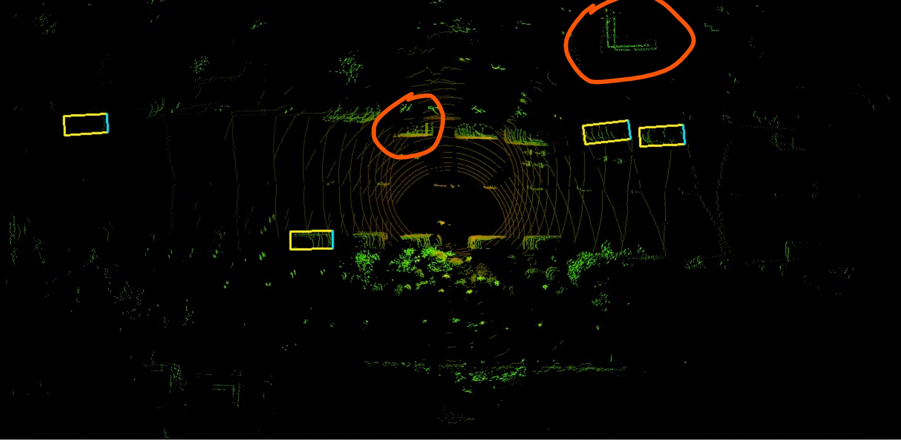

# Vehicle-Road-Cooperative-Perception-demo
**About this demo**

Thanks for your viewing, In this project,  I'll show a demo of a lidar point cloud-based raw-data level fusion vehicle-road cooperative-perception.  Affected by some reasons,  I could not open source, however, I'll try my best to open the whole source code in the future.

**Vehicle-Road-Cooperative-Perception**

Affected by blind spots, occlusion, sparse... Perception only with the sensors(lidar, camera, radar...) of a single vehicle can not handle complex scenes well of an autonomous vehicle  in city scenes. However, fusing the road-side sensors' data can greatly improve the perception of a single vehicle.

**Contributions**

1. proposing a real-time data transmission method with the existing C-V2X system.
2. proposing a  preliminary lidar point cloud only raw-data fusion method between vehicle and road-side.
3. proposing a real-time method to correct the error of initial fusion in 2.

**demo-video**

My object detect framework is based on complex-yolov4(https://github.com/maudzung/Complex-YOLOv4-Pytorch), Thanks  maudzung a lot for provide such a  practical project!

**result of a single car:**

**result of a car fusing with road-side data(rough registration):**

Obviously, more objects are detected than a single car, however, you can notice that there are some clear misalignment in the regions of red circles:

**result of a car fusing with road-side data(fine registration):**

Now, the misalignments are corrected and more objects are detected:

